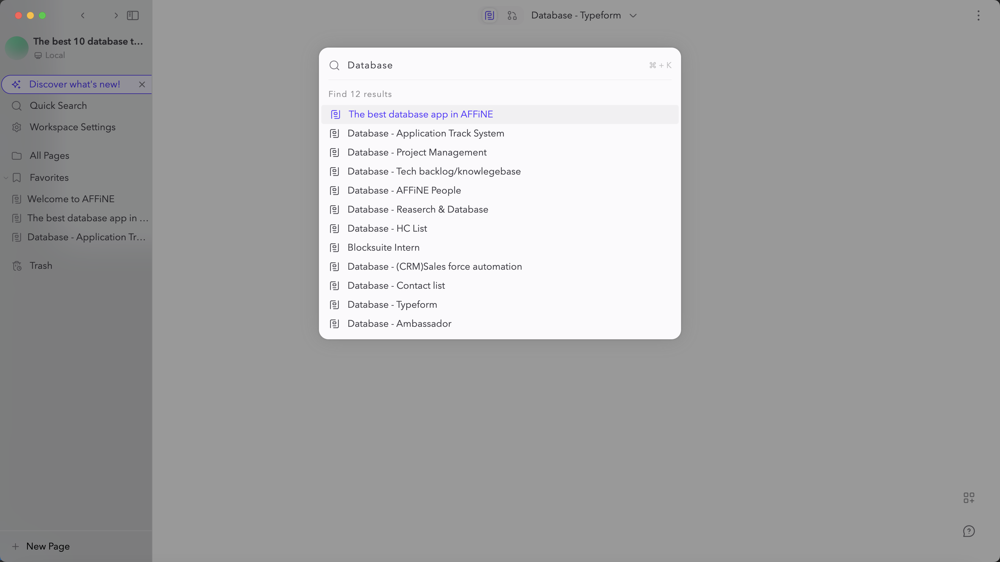
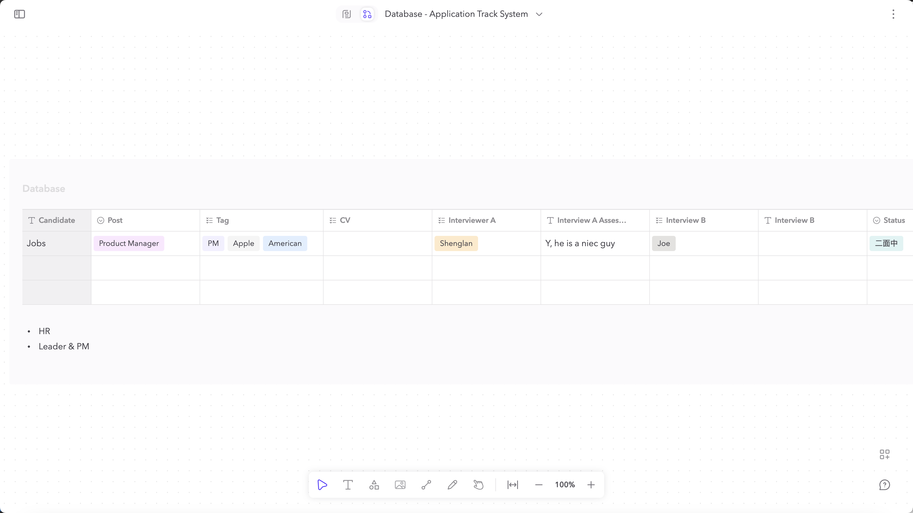
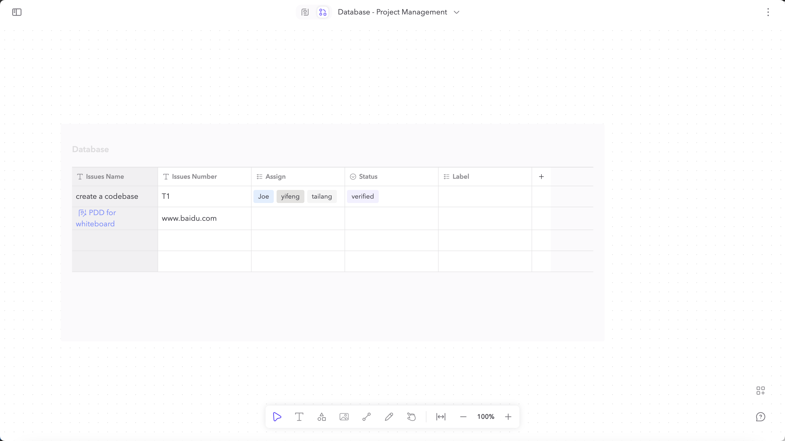

# affine-database-template

AFFiNE Template for Dashboard with Knowledge Base and Management System for PKM

import `data/affine-database-template.affine ` into your [AFFiNE Client](https://github.com/toeverything/AFFiNE/releases) , visit guide

## The list of database in AFFiNE

## Sample 1 - Application Track System

## Sample 2 - Project management

